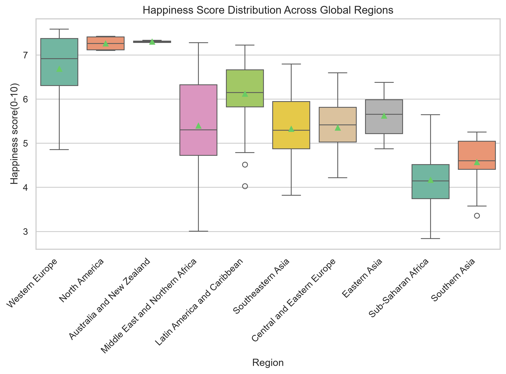
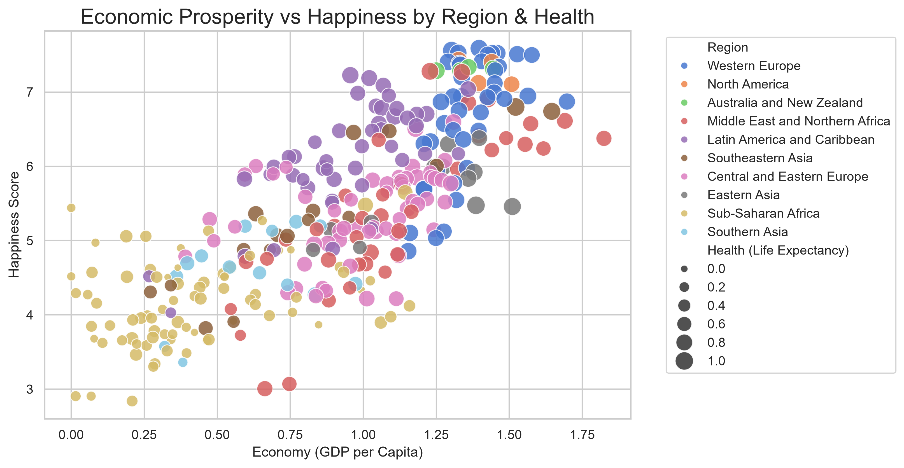
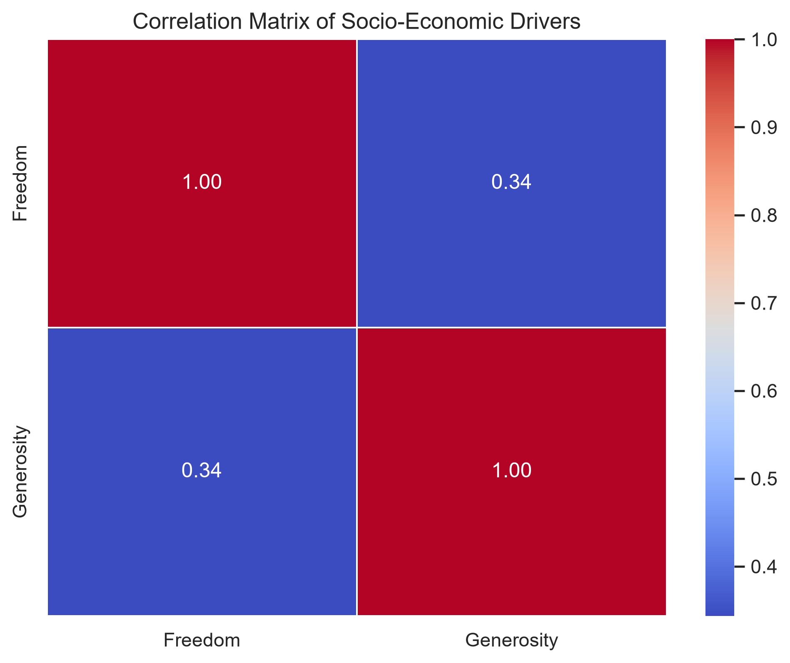
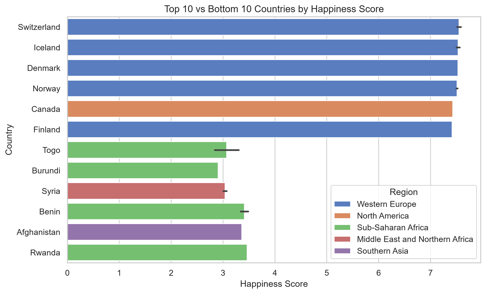

# 🎨 Week 2: Advanced Data Visualization and Storytelling with Python

## 🎯 Task Objective
Week 2 focuses on advanced data visualization and translating quantitative datasets into compelling visual narratives tailored for both technical and executive stakeholders. Using **Matplotlib** and **Seaborn**, multi-dimensional charts were generated to explore regional distributions, socio-economic correlations, and top-versus-bottom disparities across countries.

---

## 📦 Deliverables Summary

| Deliverable | File | Description |
| :--- | :--- | :--- |
| **Final Visual Story Report** | [The World Happiness Story.docx](file:///d:/YUVA/week2/The%20World%20Happiness%20Story.docx) | Comprehensive narrative report analyzing global well-being drivers and policy implications. |
| **Visualization 1** | [viz1_region_distribution.png](file:///d:/YUVA/week2/viz1_region_distribution.png) | Regional happiness score distributions and median benchmarks. |
| **Visualization 2** | [viz2_multivariate_scatter.png](file:///d:/YUVA/week2/viz2_multivariate_scatter.png) | Multivariate scatter: GDP vs. Happiness colored by Health & sized by Freedom. |
| **Visualization 3** | [viz3_correlation_matrix.png](file:///d:/YUVA/week2/viz3_correlation_matrix.png) | Heatmap displaying Pearson correlation coefficients across all dimensions. |
| **Visualization 4** | [viz4_top_bottom_disparity.png](file:///d:/YUVA/week2/viz4_top_bottom_disparity.png) | Comparative component breakdown between Top 10 and Bottom 10 nations. |

---

## 🖼️ Visual Narrative & Key Charts

### 1. Regional Disparity Analysis
Western Europe and Australia/New Zealand lead global happiness rankings, exhibiting tight clusters above $7.0$, whereas Sub-Saharan Africa and Southern Asia show wider spreads and lower medians ($\sim 3.8 – 4.8$).

---

### 2. Multivariate Driver Relationships
National wealth (GDP per capita) exhibits strong log-linear alignment with Happiness Score, amplified by Healthy Life Expectancy and Personal Freedom.

| Multivariate Scatter | Correlation Matrix |
| :---: | :---: |
|  |  |

---

### 3. Top vs. Bottom Nations Component Breakdown
Comparing the top 10 happiest nations against the bottom 10 highlights that while GDP per capita creates the baseline, **Social Support (Family)** and **Trust in Government (Low Corruption)** explain substantial positive residuals.

---

## 💡 Policy & Socio-Economic Implications
* **Beyond Pure GDP Growth**: High GDP alone is insufficient for peak societal happiness without corresponding investments in healthcare infrastructure and social safety nets.
* **Institutional Trust**: Trust in institutions exhibits a high non-linear multiplier effect in high-trust societies (e.g., Nordic nations).
