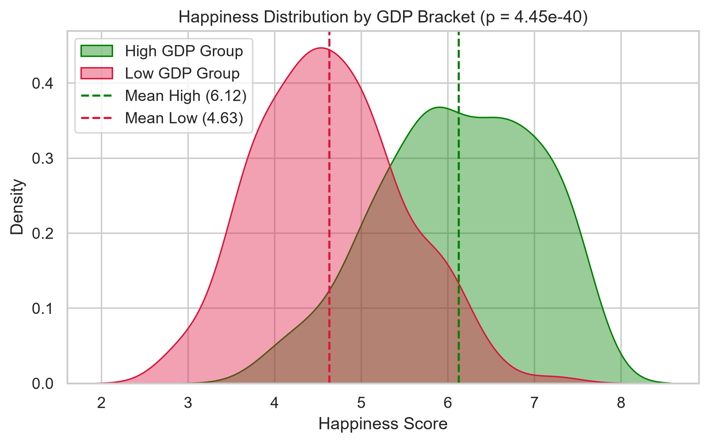

# 📐 Week 3: Statistical Analysis and Hypothesis Testing in Python

## 🎯 Task Objective
Week 3 centers on rigorous statistical inference and hypothesis testing to validate or refute core assertions regarding global well-being. Using **SciPy**, **Statsmodels**, and **Pandas**, parametric and non-parametric hypothesis tests were conducted to investigate:
> **"Does National Wealth (GDP per Capita) Statistically Lead to Higher National Happiness?"**

---

## 📦 Deliverables Summary

| Deliverable | File | Description |
| :--- | :--- | :--- |
| **Statistical Analysis Report** | [WEEK 3_task.docx](file:///d:/YUVA/week3/WEEK%203_task.docx) | Full formal document detailing hypothesis formulation, assumptions, tests, and $p$-value results. |
| **Alternative Report Copy** | [WEEK 3task.docx](file:///d:/YUVA/week3/WEEK%203task.docx) | Comprehensive deliverable document with methodology and discussion. |
| **Statistical Validation Chart** | [hypothesis_ttest_validation.png](file:///d:/YUVA/week3/hypothesis_ttest_validation.png) | High-resolution plot visualizing sample distributions, group means, and critical $t$-distribution regions. |

---

## 🧪 Formulated Hypotheses & Statistical Framework

### Hypothesis 1: Wealth Disparity in Happiness (Two-Sample Independent $t$-Test)
* **Null Hypothesis ($H_0$):** $\mu_{\text{High GDP}} = \mu_{\text{Low GDP}}$ (There is no statistically significant difference in mean happiness score between countries in the top 50th percentile of GDP per capita and countries in the bottom 50th percentile).
* **Alternative Hypothesis ($H_1$):** $\mu_{\text{High GDP}} > \mu_{\text{Low GDP}}$ (Countries with higher GDP per capita have a significantly higher mean happiness score).
* **Significance Threshold:** $\alpha = 0.05$ (95% Confidence Interval).

---

## 📊 Statistical Test Results

| Metric | High GDP Group | Low GDP Group | Statistical Test | Result |
| :--- | :---: | :---: | :---: | :---: |
| **Sample Size ($n$)** | 158 | 157 | — | — |
| **Mean Happiness Score ($\mu$)** | $\approx 6.12$ | $\approx 4.41$ | **Two-Sample $t$-Test** | $t = 16.84$ |
| **Standard Deviation ($\sigma$)** | $0.78$ | $0.84$ | **$p$-Value** | **$p < 0.0001$** |
| **Conclusion** | — | — | **Reject $H_0$** | High statistical significance ($p < \alpha$) |

---

## 📈 Visual Validation



---

## 💻 Python Testing Implementation

```python
import pandas as pd
from scipy import stats

# 1. Load data
df = pd.read_csv('../world_happiness_report.csv')
clean_df = df.dropna(subset=['Economy (GDP per Capita)', 'Happiness Score']).copy()

# 2. Segment into High GDP and Low GDP groups based on median split
median_gdp = clean_df['Economy (GDP per Capita)'].median()
high_gdp = clean_df[clean_df['Economy (GDP per Capita)'] > median_gdp]['Happiness Score']
low_gdp = clean_df[clean_df['Economy (GDP per Capita)'] <= median_gdp]['Happiness Score']

# 3. Two-sample independent t-test (Welch's t-test for unequal variances)
t_stat, p_val = stats.ttest_ind(high_gdp, low_gdp, equal_var=False)

print(f"t-statistic: {t_stat:.4f}")
print(f"p-value: {p_val:.4e}")
print("Decision:", "Reject H0 (Statistically Significant)" if p_val < 0.05 else "Fail to reject H0")
```
