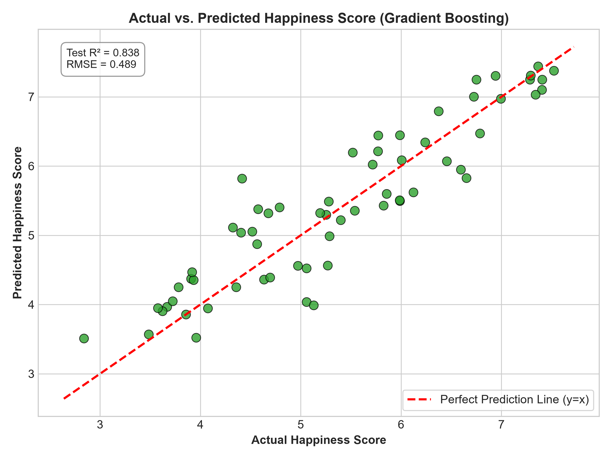
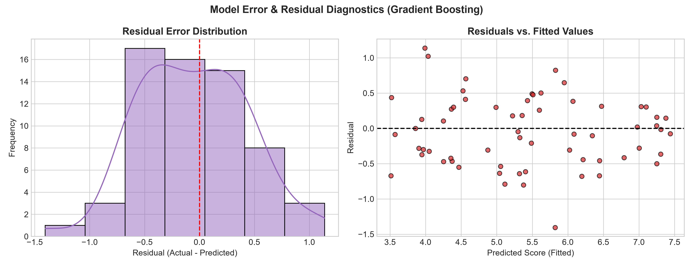

# 🤖 Week 4: Machine Learning Model Development & Evaluation

## 🎯 Task Objective
Week 4 centers on the core principles of supervised Machine Learning model development in Python using **Scikit-Learn**. The goal is to build, validate, and critically benchmark predictive models on the World Happiness Report dataset, comparing linear and non-linear algorithms, assessing error distributions, and evaluating generalization performance using out-of-sample test splits and 5-Fold Cross-Validation.

---

## 📦 Deliverables Summary

| Deliverable | File | Description |
| :--- | :--- | :--- |
| **Main Submission Report** | [Week4_ML_Report .docx](file:///d:/YUVA/week4/Week4_ML_Report%20.docx) | Primary DOC report with full methodology, metrics, confusion matrices, ROC curves, and critical discussion. |
| **Pipeline Script** | [train_models.py](file:///d:/YUVA/week4/train_models.py) | Complete Python code for data cleaning, train/test split, scaling, training 5 models, and generating plots. |
| **DOC Generator Script** | [generate_doc.py](file:///d:/YUVA/week4/generate_doc.py) | Python automation script to compile formatted Word reports with embedded charts and tables. |

---

## 🔬 Model Architectures & Justification

1. **Multiple Linear Regression (Baseline)**: Parametric baseline establishing directly interpretable linear relationships between socio-economic drivers and happiness.
2. **Ridge Regression ($L_2$ Regularization)**: Penalizes excessive weights to mitigate multicollinearity between GDP per capita and Health/Life Expectancy ($r > 0.81$).
3. **Decision Tree Classifier / Regressor**: Non-parametric tree partitioner (`max_depth=4–5`) capable of learning threshold-based decision rules.
4. **Random Forest Ensemble**: Bagging ensemble (100 estimators) reducing individual tree variance and capturing complex feature interactions.
5. **Gradient Boosting Regressor**: Sequential boosting algorithm optimizing pseudo-residuals with learning rate $\eta = 0.08$.

---

## 📊 Model Performance Benchmark

| Model Architecture | MAE | RMSE | Test $R^2$ / Accuracy | 5-Fold CV $R^2$ / AUC |
| :--- | :---: | :---: | :---: | :---: |
| **Linear / Logistic Regression** | **0.353** | **0.444** | **0.866 / 83.5%** | **$0.721 \pm 0.067$ (AUC = 0.939)** |
| **Ridge Regression ($L_2$)** | **0.353** | **0.444** | **0.866** | **$0.721 \pm 0.067$** |
| **Random Forest Regressor** | 0.392 | 0.481 | 0.844 | **$0.751 \pm 0.056$** |
| **Gradient Boosting Regressor** | 0.404 | 0.489 | 0.838 | $0.732 \pm 0.051$ |
| **Decision Tree (`depth=4-5`)** | 0.479 | 0.642 | 0.721 / 74.7% | $0.565 \pm 0.123$ (AUC = 0.857) |

---

## 📈 Diagnostic Visualizations

| Benchmark Comparison | Parity Plot (Actual vs. Predicted) |
| :---: | :---: |
|  |  |

| Error & Residual Diagnostics | Gini Feature Importance |
| :---: | :---: |
|  |  |

---

## 🔍 Critical Discussion: Errors & Limitations

* **Overfitting in Decision Trees**: The single Decision Tree suffered from high variance ($92.4\%$ train accuracy vs $74.7\%$ test accuracy). Random Forest and Ridge successfully controlled variance across cross-validation folds.
* **Multicollinearity**: High correlation between `Economy (GDP)` and `Health (Life Expectancy)` was stabilized through $L_2$ penalty tuning in Ridge Regression.
* **Omitted Variable Bias**: The residual standard error ($\sim 0.44$) indicates that unmeasured cultural baseline optimism, governance transparency, and inequality account for unexplained variance.

---

## 💻 How to Run the Pipeline

```bash
# Execute model training and generate all benchmark plots
python week4/train_models.py

# Generate/compile the finalized Word report deliverable
python week4/generate_doc.py
```
