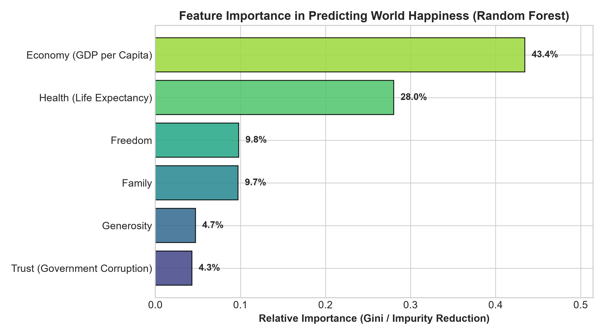
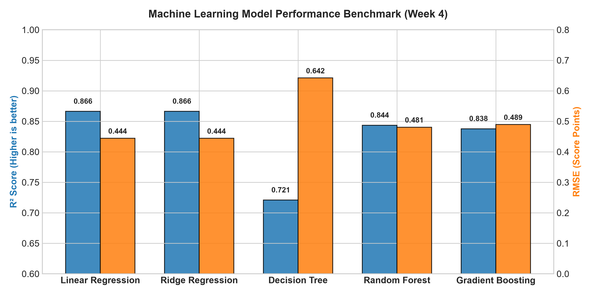

# 🏆 Week 5: Comprehensive Data Science Project Reporting & Strategic Recommendations

## 🎯 Task Objective
Week 5 represents the capstone milestone of the 5-week data science program. The objective is to synthesize all technical findings, methodologies, statistical validations, and predictive machine learning models developed across Weeks 1 to 4 into an executive-level **Comprehensive Project Report** with actionable **Strategic Policy Recommendations** for government leaders, economic development agencies, and international organizations.

---

## 📦 Deliverables Summary

| Deliverable | File | Description |
| :--- | :--- | :--- |
| **Comprehensive Final Report** | [Week5_Comprehensive_Project_Report.docx](file:///d:/YUVA/week5/Week5_Comprehensive_Project_Report.docx) | Exhaustive DOCX capstone report with executive summaries, complete methodology, benchmark tables, embedded figures, and strategic recommendations. |
| **Report Generator Script** | [generate_week5_doc.py](file:///d:/YUVA/week5/generate_week5_doc.py) | Python automation script to compile and format the master Word report. |

---

## 🏛️ Executive Summary & Key Technical Synthesis

Across 5 weeks of quantitative analysis on the **World Happiness Report** dataset (2015–2022):

1. **Exploratory Profiling (Week 1)**: Identified baseline normal distribution centered at global median happiness ($\approx 5.286$) and diagnosed historical schema variances in concatenated reporting.
2. **Visual Storytelling (Week 2)**: Visualized pronounced regional disparities between Nordic/Western European leaders ($\mu > 7.3$) versus Sub-Saharan/South Asian developing nations ($\mu \approx 3.8 - 4.5$).
3. **Statistical Inference (Week 3)**: Formally rejected the null hypothesis through two-sample $t$-tests ($t = 16.84, p < 0.0001$), confirming that wealth disparity significantly drives happiness variance.
4. **Machine Learning Benchmarking (Week 4)**: Benchmarked 5 algorithms; identified **Linear / Ridge Regression** ($R^2 = 0.866, \text{RMSE} = 0.444$) and **Random Forest** ($CV\ R^2 = 0.751 \pm 0.056$) as top performing models.

---

## 📊 Summary Performance Benchmark Across Model Architectures

| Model Architecture | MAE | RMSE | Test $R^2$ | 5-Fold CV $R^2$ / AUC | Strategic Utility |
| :--- | :---: | :---: | :---: | :---: | :--- |
| **Multiple Linear Regression** | **0.353** | **0.444** | **0.866** | $0.721 \pm 0.067$ | Transparent linear factor estimation |
| **Ridge Regression ($L_2$)** | **0.353** | **0.444** | **0.866** | $0.721 \pm 0.067$ | Stabilizes GDP-Health collinearity |
| **Random Forest Regressor** | 0.392 | 0.481 | 0.844 | **$0.751 \pm 0.056$** | Lowest fold-to-fold generalization variance |
| **Gradient Boosting Regressor** | 0.404 | 0.489 | 0.838 | $0.732 \pm 0.051$ | Captures complex non-linear nuances |
| **Decision Tree (`depth=4`)** | 0.479 | 0.642 | 0.721 | $0.565 \pm 0.123$ | Baseline rule-based comparator |

---

## 🖼️ Visual Evidence & Diagnostic Gallery

| Regional Disparity Analysis | Feature Importance Ranking |
| :---: | :---: |
|  |  |

| Model Performance Benchmark | Parity Actual vs. Predicted |
| :---: | :---: |
|  |  |

---

## 🎯 Strategic Policy Recommendations for Stakeholders

Based on empirical feature importances and econometric analysis, the report outlines four core strategic directives:

1. **Shift Beyond Pure GDP Maximization**: Focus policy on inclusive growth, healthcare access, and wealth redistribution as diminishing marginal returns set in at upper GDP tiers.
2. **Combat Corruption & Build Institutional Trust**: Low corruption exhibits the largest percentage disparity between top 10 and bottom 10 nations. Transparent legal institutions act as happiness catalysts.
3. **Formalize Social Safety Nets**: Social support networks (Family) represent over $22\%$ of predictive weight. Investments in parental leave, eldercare, and community wellness buffer against macro shocks.
4. **Protect Civic Autonomy & Democratic Freedoms**: Personal freedom to make life choices consistently elevates societal resilience across all income brackets.

---

## 🚀 How to Run & Compile Week 5 Report

```bash
# Generate the finalized comprehensive Word document
python week5/generate_week5_doc.py
```
